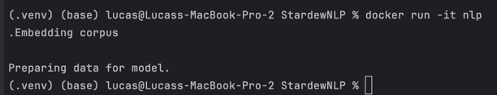
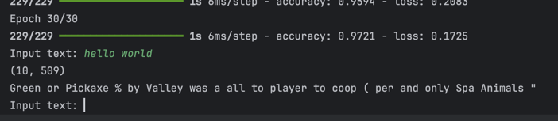

# stargaze
The main objective was to create a language model trained off of the [Stardew Valley
wikipedia](https://stardewvalleywiki.com/Stardew_Valley_Wiki). This is divised into
multiple steps: extracting data, preparing it for a model, training a model, and 
then allowing a user to user the model. 

## Steps
Originally I wanted to create a language model based in the proposal. 
After reviewing and testing, I adjusted my work to do what I was able to code. 
Admittedly, this is likely due to an inexperience with keras, which I have also discussed below, 
in learning improvements. 

## Preprocessing
I created a wikiparser to pull web pages and save the contents into a single .txt
file. It saves the paragraphs only. This is in `parsewiki.py`.

## Training

This is done in `processing.py` and `rnn.py`.

Training was completed using pythons `keras` module. I built a Recurrent Neural Network and trained
it on the wiki pages of Stardew. For this to work, I had to parse the wiki, save it, and then load 
it for the model to use. 

Tokenization was done by using the `spacy` module. I considered each document a wikipedia page. 
When storing the pages in a file, I kept one document per line, which made it easy
for parsing documents. 

Labeling was done via the `sklearn` `LabelEncoder` class, with each label being a word.

### Features and labels
- Each word is labeled via `LabelEncoder` and is a unique number
- The input vector (x) is a combination of:
  - The current token's spacy vector
  - The 10 previous parts of speech (if known; if not known, then I used `<S>` as a placeholder)


### Performance
Originally I wanted to utilize a f1 score, however encountered issues doing so with keras. As I am unfamiliar
with keras, I could not understand (nor find documentation online) as to how to effectively train a model 
using the f1 score. Instead, I utilized accuracy as that was the default usage and seemed widely available in online tutorials.

Testing on 46 documents, we find an accuracy of around 42%. By default, the model is set to pull 10
wiki documents.

I found that adding previous parts of speech did increase performance. I tried a few methods, but 
ultimately landed on using 10 previous parts of speech. This is not a highly calculated decision, and I
did not try all variations of 1-10 to identify which was the most optimal. 
### How to use it
- Currently I have not processed input as a feedback loop. That means that you would have to put\
your text sequence of what you want into code and run it
- I also have not made the ability to load a model. There are is a concern on the trainability side
of this. There are about 3,000 wiki pages; on training with around 250 of those pages, the 
training time on many epochs took a very long time. 


## Issues along the way

### `keras`

I found that keras has limited documentation for this specific use case. With limited 
knowledge about RNNs and text generation, it took some research to find a way to use
both RNNs and the `keras.Sequential` workflow to produce a RNN that actually worked. 

Some combinations that I tried that were unsuccessful
- Using the `model.add(layers.LSTM(3))` 
- Using more than 2 `SimpleRNN` layers. This provided me with issues on dimensionality, and I was unsure how to adjust the dimensionality to fit what the model wanted

### Dimensionality
- I found this to be the biggest issue. Not the curse of dimensionality,
but rather providing the model with the correct dimensions that it needs.
I anticipated inputting a 2d vector into the sequential model. 
Each observation would represent a vectorized word, which would
then do into the RNN. However it became apparent that keras did not like that. 
Instead if required a 3 dimensional input, which from what I understand now
is a timestep. I adjusted the model to account for a 3d input.
  - Originally not knowing what a timestep was I used a timestep=1.
  I thought that looked a little weird and made no sense so I further researched why this might be used.
  - After some research, I found that it would be the previous tokens, so I adjusted
  the model to be an input of (1, # timesteps, # features). 

# Next steps
- Use the `gensim` model. This contains a Word2Vec implementation that I could've used
To get token vectors. 
- Improve model performance 
- Reduce usage of highly frequent tokens (e.g., `the`)
- Change the timesteps. This is hardcoded in most places, but for future improvement I 
would like to adjust this to see how it affects the output.


# How to run
I have created a docker file to use. I also support saving the model, as
training a large one could take some time. I found that using a docker container does not work,
however, likely due to when keras is training and for the need for input. Using `docker -it` would run
the file in bash as interactive so that you could provide input. As you will see here, the docker
container does run but does not continue when it gets to the keras training portion: 


```bash
docker run -it nlp
```
Which kills the container once you get to the model training portion




### Full process
- If you have not already pulled the wiki pages, by default `main.py` does so, and by default it does not 
use any saved model. In essence, run `main.py` and it will pull 10 articles and train a model. 

Instead, since Docker does not work, you can :

- You will need to install relevant modules beforehand.
```
pip install numpy keras tensorflow spacy bs4 pandas
pip install scikit-learn
python -m spacy download en_core_web_md
```


- Via a Linux terminal, run 
```
python3 main.py
```

Running main will web scrape, train a model with 30 epochs, and allow you to prompt the model. 

- Once you run and train, the model will prompt you for input like it does here




### Adjustments you can make
- Depending on which spacy module you want to use, 
you will need to download either `en_core_web_sm`, `en_core_web_md`, or `en_core_web_lg` from spacy.
From above, we use `en_core_web_md` and that is the default usage.


- in `main.py`, adjust 
  - The filename variable for the contents you want to read
  - The spacy input for the size of spacy model to use
  - If you are parsing, change `max_articles` to be the numer of articles you wish to parse